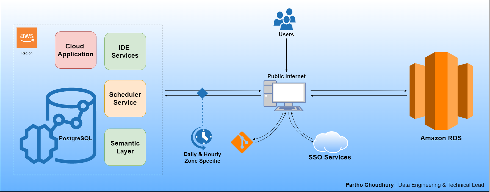

# **Build an Outstanding AWS Infrastructure with Terraform, which inspires high levels of scalability and performance within AWS Cloud.** :computer: #

The purpose of this project was to create a Web Application where all the concerned teams can find the right information related to their Operational and Regulatory Information.

**This project is divided in 4 Chapters:**
- [**Chapter 1**:](https://github.com/ianthropos88/awscloud_web_app_Ch.1) This article provides the overview and plan to create a 3 Tier Web Application for storage and interaction of Operational and Regulatory information in an Agricultural Company within AWS Cloud.
- [**Chapter 2**:](https://github.com/ianthropos88/awscloud_web_app_Ch.2) This article provides a look at the classic 3 Tier Web Application Architecture, and how it can leverage the AWS Cloud Computing Infrastructure.
- [**Chapter 3**:](https://github.com/ianthropos88/awscloud_web_app_Ch.3) This article provides an overview and solution for a Cross-Region Deployment which is presently not supported by the AWS CodePipeline.
- [**Chapter 4**:](https://github.com/ianthropos88/awscloud_web_app_Ch.4) This article provides and overview and solution on how we can easily set up and manage an entire CI/CD pipeline in AWS accounts using the native AWS suite of CI/CD services, and deploying the application in 3 Regions (Development, Staging, & Production).

## > :rocket: **Thank you for your interest in my work.** :blush: ##

This solution aims at deploying a 3 Tier Web Application for storage and interaction of Operational and Regulatory information for a Global Agricultural Company within AWS Cloud.

The project is supported by several managed services including **Amazon Elastic Compute Cloud (Amazon EC2)**, **Route 53**, **CloudFront**, **Secrets Manager**, **CloudTrail**, **Security Hub**, **Amazon ECR**, **Transit Gateway**, and required **Cross-Region Replications**, etc.

# **Web App Optimization** :hourglass_flowing_sand::clock10: #

### ✔️ Problem Statement ###

-> Hypothesis of what customer problem we are trying to solve!

1. Finished Operational Test Results Required, is sent to the officials with wrong denomination of the destination country or the subjects to be declared free from or to be tested.
2. Shipment documentation does not match with country requirements.
3. Bag print or layout is not in line with the country's request.

On the Regulatory Document, we did not have a tool. On the transport documentation we had a tool, however, we faced accuracy issues with it. In case of the bag print, a project was pulled together but still some countries were kept out of scope.

In a similar case, few regulatory information were recorded, but we knew that, not all the cases were registered and they were only reported by emails.

#### ✔️ Objectives ####

-> How we are trying to solve it!

Create a highly scalable Web App with a distributed relational database, where all the concerned teams can find the right information related to the Regulatory information to request, bag layout, and the transport documentation. All the information needed to be related to the Initial Article Number and it must be able to track when the changes were done.

#### ✔️ Deliverables ####

1. Flow Process: AS IS
2. Flow Process: Future State
3. Web Interface Tool Accessible for all Stakeholders
4. Clear Roles in the Process - DACI

#### ✔️ Critical Success Factors ####

-> What will be the impact of it!

1. Management of Change.
2. Countries & Reional Ownership of the Process.
3. Good Application from the database to the Production Sites.

#### ✔️ Measures: KPIs & Benefits ####

-> Why we are trying to solve it!

1. Non-conformities due to wrong delivery documentation.
2. Waiting time for Regulatory Document Corrections.
3. Bag printing issues and financial consequences (rework, manual relabeling, etc.).

#### ✔️ Issues and Risks ####

- Input collection accuracy and in-time records.

# **Key considerations when using AWS for Web Hosting** :unlock: #

There are some key differences between the AWS Cloud and a traditional web application hosting model. This section points out some of the key architectural shifts that you need to consider when you bring any application into the cloud.

1. **No more physical network appliances** - You cannot deploy physical network appliances in AWS. For example, firewalls, routers, and load balancers for your AWS applications can no longer reside on physical devices, but must be replaced with software solutions. There is a wide variety of enterprise-quality software solutions, whether for load balancing or establishing a VPN connection. This is not a limitation of what can be run on the AWS Cloud, but it is an architectural change to your application if you use these devices today.

2. **Firewalls everywhere** - Where you once had a simple demilitarized zone (DMZ) and then open communications among your hosts in a traditional hosting model, AWS enforces a more secure model, in which every host is locked down. One of the steps in planning an AWS deployment is the analysis of traffic between hosts. This analysis will guide decisions on exactly what ports need to be opened. You can create security groups for each type of host in your architecture. You can also create a large variety of simple and tiered security models to enable the minimum access among hosts within your architecture. The use of network access control lists within Amazon VPC can help lock down your network at the subnet level.

3. **Consider the availability of multiple data centers** - Think of Availability Zones within an AWS Region as multiple data centers. EC2 instances in different Availability Zones are both logically and physically separated, and they provide an easy-to-use model for deploying your application across data centers for both high availability and reliability. Amazon VPC as a Regional service enables you to leverage Availability Zones while keeping all of your resources in the same logical network.

4. **Treat hosts as ephemeral and dynamic** - Probably the most important shift in how you might architect your AWS application is that Amazon EC2 hosts should be considered ephemeral and dynamic. Any application built for the AWS Cloud should not assume that a host will always be available and should be designed with the knowledge that any data in the EC2 instant stores will be lost if an EC2 instance fails.

When a new host is brought up, you shouldn’t make assumptions about the IP address or location within an Availability Zone of the host. Your configuration model must be flexible, and your approach to bootstrapping a host must take the dynamic nature of the cloud into account. These techniques are critical for building and running a highly scalable and fault-tolerant application.

##  **Initiation: Data Flow** :blue_book: ##

**Web App Data Flow**

The flow of a web application is characterized by the systematic organization of web pages, page data, page actions, and mappings to business logic and the interconnection of these components. The web diagram tools provide you with a visual way to create and manage the data flow of your web application.

**Key features**

1. **Autoscaling of resources and dynamic work rebalancing** - Minimize pipeline latency, maximize resource utilization, and reduce processing cost per data record with data-aware resource autoscaling. Data inputs are partitioned automatically and constantly rebalanced to even out worker resource utilization and reduce the effect of “hot keys” on pipeline performance.

2. **Flexible scheduling and pricing for batch processing** - For processing with flexibility in job scheduling time, such as overnight jobs, flexible resource scheduling (FlexRS) offers a lower price for batch processing. These flexible jobs are placed into a queue with a guarantee that they will be retrieved for execution within a six-hour window.

3. **Ready-to-use real-time AI patterns** - Enabled through ready-to-use patterns, Dataflow’s real-time AI capabilities allow for real-time reactions with near-human intelligence to large torrents of events. Customers can build intelligent solutions ranging from predictive analytics and anomaly detection to real-time personalization and other advanced analytics use cases. 

The following dataflow design illustrates the workflow:

  

<b>Scenario 1:</b> The Web App Data Flow.

#  **Architecture: AWS Cloud** :cloud: #

## **Project Plan** :black_nib: ##

  

<b>Scenario 2:</b> The Project Plan - AWS Cloud.

Modern apps are fueled by data. Whether the data is user-generated or provided by content creators, the success of an app depends on the management of that data. Our app generates a lot of data. Not only lists of things that need to be done, but also how fast they are done, the priority, and perhaps a prediction of when items on the list are finished. This data should be synced between different devices. This is essential because it will enable our customers to be as productive as possible, no matter which device they use or where they are. All this functionality increases engagement with the app, which yields more opportunities to make it successful.

## **Conclusion** ##

Security and user management, modelling and syncing data, sending push notifications to devices, analyzing user behavior, and testing are building blocks for a strong technical foundation that great apps have. AWS Amplify makes it easy to set up the needed services on the AWS Cloud and integrate them into your app, which lets you bypass many of the technical challenges you face when starting your business. The services the app leverages are built to be secure and scalable, and you stay in full control of them. You can move fast and inherit the best practices from AWS Amplify, and you can also customize the services as your business grows.

Have fun, and build on! :thumbsup:

# About Me :sunglasses: #
- With 10+ years of industry experience, I have thrived in Data Science, Data Governance, IT, Cloud and Product Management. I have a keen interest and expertise in solving business problems using unique logic and analytics. I bring solutions to the table based on competitive Business Acumen and Human Intelligence.
- Have a look at my portfolio: [Helping organization level all their Seeds Business arguments using Data & Technology | Ex_Zalando | Ex_Freecharge | Ex_Myntra Jabong | Ex_Supercell | Ex_Infosys](https://www.linkedin.com/in/pnchoudhury/)
- I love talking about #cloudarchitecture, #businessanalytics, #datapipelines, #machinelearning, and #artificialintelligence
